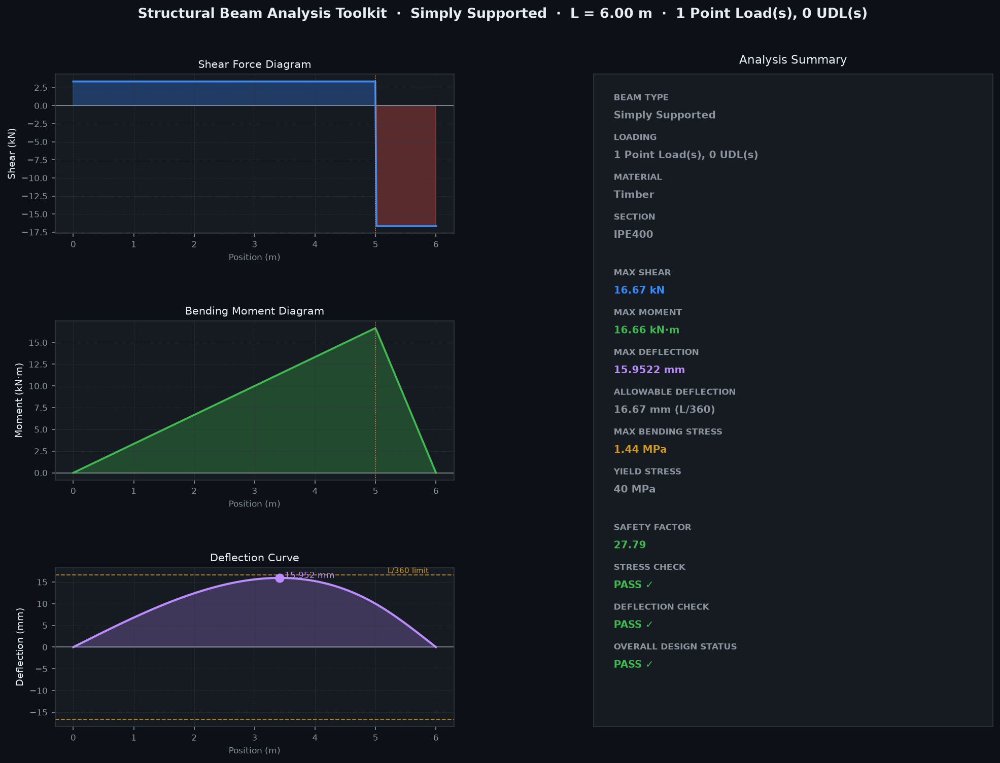

# Structural Beam Analysis & Design Toolkit

A full-stack structural engineering web application built with Python and Flask. Goes beyond a simple beam calculator — it analyzes, optimizes, and **explains its reasoning** using classical beam theory, wrapped in a modern browser-based interface.




---

## What it does

You place supports on a beam (Pin, Roller, Fixed), add loads, pick a material and section — and the app runs a full structural analysis: shear force, bending moment, deflection, stress, factor of safety, and serviceability checks. If the design fails, it automatically tells you *why* and gives ranked engineering recommendations to fix it.

Three modes are available:

| Mode | What it solves |
|---|---|
| **Standard Analysis** | Checks whether your beam design is safe |
| **Design Optimization** | Finds the best material + section for a chosen objective |
| **Missing Parameter Solver** | Solves for an unknown (load, span, section, or material) |

---

## Features

### Interactive Beam Configuration
Instead of picking "Simply Supported" from a dropdown, you place supports at specific positions — just like structural modelling software:

- **Pin + Roller** → Simply Supported
- **Single Fixed** → Cantilever
- **Fixed + Fixed** → Fixed-Fixed

Invalid configurations (Fixed+Pin, three supports, lone Pin, etc.) are rejected with a clear engineering explanation.

### Multiple Simultaneous Loads
Stack any number of point loads and UDLs (full-span or partial-span) on one beam. All effects are combined using the **principle of superposition**, validated against Beer & Johnston closed-form solutions to within 0.01%.

### IPE Steel Section Database
16 standard IPE sections (IPE80–IPE500) loaded from a CSV catalogue with area, moment of inertia, section modulus, and weight per metre.

### Serviceability Checks
Every analysis checks deflection against **L/360** (floors) or **L/250** (roofs), reported as independent Stress Check, Deflection Check, and Overall Design Status.

### Multi-Objective Design Optimization
Searches every (material × section) combination — 64 in total — and returns the best feasible design for:
- Minimum Weight
- Minimum Material Cost
- Maximum Factor of Safety
- Minimum Deflection

### Intelligent Design Advisor
When a design fails, the advisor quantifies the shortfall (e.g. "deflection exceeds limit by 208%") and generates ranked, **calculation-based** recommendations — upgrade section, reduce span, reduce load, switch material — each independently verified by re-running the solver.

### Missing Parameter Solver
Leave one variable blank and the solver uses bisection search to find the safest feasible value:
- Maximum allowable load
- Maximum permissible span
- Lightest safe section
- Most suitable material

---

## Tech Stack

| Layer | Technology |
|---|---|
| Backend | Python, Flask |
| Structural solver | NumPy (custom beam theory implementation) |
| Plots | Matplotlib (rendered server-side, returned as base64 PNG) |
| Frontend | Vanilla HTML/CSS/JS (no framework, no build step) |
| Deployment | Render.com (free tier) |

---

## Run locally

```bash
# Clone the repo
git clone https://github.com/YOUR_USERNAME/structural-beam-toolkit.git
cd structural-beam-toolkit

# Create a clean environment (recommended)
conda create -n beamtoolkit python=3.11
conda activate beamtoolkit

# Install dependencies
pip install flask numpy matplotlib gunicorn

# Run
python app.py
```

Then open `http://localhost:5000` in your browser.

---

## Project Structure

```
structural-beam-toolkit/
│
├── app.py                    # Flask backend — API routes
├── templates/
│   └── index.html            # Single-page frontend (HTML/CSS/JS)
│
├── beam_solver.py             # Core solver: V, M, deflection via superposition
├── beam_config.py             # Support placement + beam-type classification
├── design_checks.py           # Stress, deflection, safety factor checks
├── design_advisor.py          # Failure diagnosis + ranked recommendations
├── missing_param_solver.py    # Bisection-based unknown parameter solver
├── optimizer.py               # Multi-objective design search
├── materials.py               # Material database (Steel, Aluminium, Concrete, Timber)
├── sections_db.py             # IPE section CSV loader
├── plotting.py                # Dark-mode Matplotlib diagrams
├── ipe_sections.csv           # IPE80–IPE500 section properties
│
├── requirements.txt
├── Procfile
└── render.yaml                # One-click Render.com deployment config
```

---

## Deploy to Render (free)

1. Push this repo to GitHub
2. Go to [render.com](https://render.com) → New → Web Service
3. Connect your GitHub repo — Render auto-detects `render.yaml`
4. Click **Deploy** — live in ~2 minutes
5. Update the Live Demo link at the top of this README

---

## Validation

Solver results verified against textbook closed-form solutions (*Beer & Johnston, Mechanics of Materials, 7th Ed.*):

| Case | Formula | Match |
|---|---|---|
| SS beam, point load at midspan | δ = PL³/48EI | ✓ <0.01% |
| SS beam, full UDL | δ = 5wL⁴/384EI | ✓ <0.01% |
| Cantilever, end point load | δ = PL³/3EI | ✓ <0.01% |
| Fixed-Fixed, full UDL | δ = wL⁴/384EI | ✓ <0.01% |
| Superposition (point + UDL) | Sum of individual responses | ✓ <0.01% |

Support classification tested against 14 cases including all valid configurations and 11 rejection cases.

---

## References

- Beer, F.P. & Johnston, E.R. — *Mechanics of Materials*, 7th Ed.
- Hibbeler, R.C. — *Structural Analysis*, 10th Ed.
- Eurocode 3 / IS 800 — IPE section properties and serviceability limit conventions

---

## Author

**Piyush Jaiswal** — Mechanical Engineering student  
[github.com/YOUR_USERNAME](https://github.com/YOUR_USERNAME)